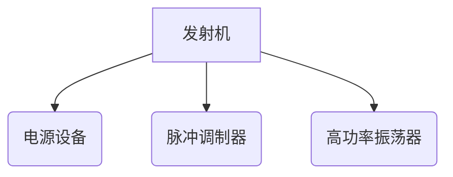

<head>
    
    
</head>

# 0 基本概念

## 0.1 基本概念补充

## 0.2 频域参数

### 载波

载波或者载频（载波频率）是一个物理概念，是一个特定频率的无线电波，单位Hz，是一种在频率、幅度或相位方面被调制以传输语言、音频、图象或其它信号的电磁波。

### 带宽

带宽（英语：**Bandwidth**）指[信号](https://zh.wikipedia.org/wiki/信号)所占据的[频带](https://zh.wikipedia.org/wiki/频带)宽度；在被用来描述[信道](https://zh.wikipedia.org/wiki/信道)时，带宽是指能够有效通过该信道的信号的最大频带宽度。

###  突发信号(burst)

在数据通信中，按照特定准则或度量算作一个单位的各信号组成的序列。

### 波特(Baud)

在电子通信领域，波特率（Baud rate）即调制速率，指的是有效数据信号调制载波的速率，即单位时间内载波调制状态变化的次数。它是对符号传输速率的一种度量，1波特即指每秒传输1个符号，而通过不同的调制方式，可以在一个码元符号上负载多个bit位信息。 单位“波特”本身就已经是代表每秒的调制数，以“波特每秒”（Baud per second）为单位是一种常见的错误。

### 码元

在数字通信中常常用时间间隔相同的符号来表示一个[二进制数字](https://baike.baidu.com/item/二进制数字/5920908)，这样的时间间隔内的信号称为(二进制）码元。 而这个间隔被称为码元长度。值得注意的是当码元的离散状态有大于2个时（如M大于2个） ，此时码元为M进制码元。

# 1 信号分析

## 1.1 常用信号特征

高阶谱：高阶谱定义为高阶累计量的傅里叶变换。理论上可以包括信号的全部信息，能够为模式识别何信号分类提供有用特征。

双谱：高阶谱中最基本的一种，包含了信号的相位信息以及各种频率分量的相关信息，是非高斯时间序列的一个重要工具。

功率谱：反映信号的二阶统计量(如相关函数)，丢失了包括相位在内的高阶信息。

## 1.2 奇异谱分析-SSA（Singular Spectrum Analysis）

[奇异谱分析](https://wiki.mbalib.com/wiki/奇异谱分析)

[SSA tutorial with Matlab](https://ww2.mathworks.cn/matlabcentral/fileexchange/58967-singular-spectrum-analysis-beginners-guide/?s_tid=ILM2FXsub)

## 1.3 常用公式

欧拉公式：

$e^{ix}$=cosx+i*sinx

$e^{jwx}=coswx+j*sinwx$

傅里叶变换公式：

$s(w)=\frac{1}{2\pi}\int_{-\infty}^{+\infty}x(t)e^{-jwt}dt$

* 傅里叶变换的几个特性
  * 可加性
  * 对称性
  * 共轭性
  * 比例性
  * 时延
  * 频移
  * 调制
  * 微分
  * 卷积定理

傅里叶逆变换公式：

$x(t)=\frac{1}{2\pi}\int_{-\infty}^{+\infty}s(w)e^{jwt}dt$

B： 信号带宽

## 1.4 信号双谱特征

# 2 信号补偿

数字补偿：在计算机数据采集系统中，以数字运算方式对现场采集的信号进行补偿，达到线性化或消除某些因素影啊的目的。如热电偶信号冷端补偿、流量信号开平方运算、变送器非线性补偿、执行器非线性补偿等。

# 3 信号去噪

## 3.1 EMD(Empirical Mode Decomposition)

## 3.2 VMD（Variational Mode Decomposition）

变分模态分解（Variational Mode Decomposition,VMD）是由 Dragomiretskiy 等人提出的一种自适应信号处理方法，通过迭代搜寻变分模态 的最优解，不断更新各模态函数及中心频率，得到若干具有一定宽带的模态函数。 VMD算法是一种递归算法，有严格的数学理论做支撑！

## 3.3 Hibert 变换

很好的一篇博客：https://blog.csdn.net/edogawachia/article/details/79366444

物理意义：

关于信号转换到复平面后的直观理解。

# 4 基本的实验做法

* 信号来源 

  * 仿真
    * 不同信噪比
  * 真实

* 传统特征

  * 高阶(双谱)
  * 希尔伯特谱
  * 时域信号(图像)

  

# 5 论文初筛列表

* EI

  基于堆栈式 LSTM 网络的通信辐射源个体识别;

  基于变分自编码器的雷达辐射源个体识别

  基于机器学习的辐射源识别_苟嫣

  基于机器学习的雷达辐射源识别方法综述_孟磊

  基于局部双谱和深度卷积神经网络的通信电台识别研究_曹阳

  基于人工智能的辐射源识别技术研究_袁博

  基于深度残差网络的ADS_B信号辐射源个体识别_翁琳天然

  基于时频分析和CNN的雷达辐射源识别算法_黄智

  基于栈式稀疏降噪自编码网络的辐射源调制识别_李东瑾

  深度学习方法在雷达信号识别若干问题上的研究与应用_陈俊达

  

* 小样本

  * 数据扩充
  * 分类方法 

* 信号仿真参考图书

# 6 实验设置

* 查找公开数据集
* 产生仿真信号  

  * HFSS仿真软件
  * 
  * 
  * 
  * 
  * 
  * 
  * 
  * 
  * 
* 产生仿真假信号
  * 不同信噪比
  * 不同噪声类型模拟辐射源差异
* 信号处理——提取传统特征
  * stft
  * 双谱
  * 希尔伯特谱
  * 对信号进行预处理后提取某些显性特征
* 信号识别

  * 小样本方法-解决数据量少的问题
    * 匹配 matching network，prototypical net(识别未知样本)。
    * 生成对抗网络扩充样本，加入噪声提高生成鲁棒性 ；  分类过程对置信度低样本加入伪标签。
  * 鲁棒的深度聚类，识别未知样本。
  * GAN无监督，利用未带标签数据指引混合带标签数据训练semi-Supervise Gan，对样本进行分类，解决生成对抗网络训练模式崩塌问题。

## 6.1 Radar(Radio detection and range)雷达数据搜索关键词

* radar pluse data
* radar waveform data
* radio signal 
* ADS-B pulse data

## 6.2 借阅信息

# 7 雷达信号

* 基础：检测理论，雷达波形设计

* 辐射源个体识别方法研究
* 基于机器学习的辐射源个体识别

