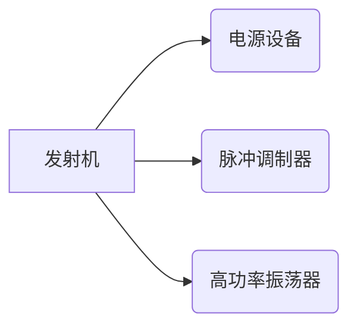

<head>
    <script src="https://cdn.mathjax.org/mathjax/latest/MathJax.js?config=TeX-AMS-MML_HTMLorMML" type="text/javascript"></script>
    <script type="text/x-mathjax-config">
        MathJax.Hub.Config({
            tex2jax: {
            skipTags: ['script', 'noscript', 'style', 'textarea', 'pre'],
            inlineMath: [['$','$']]
            }
        });
    </script>
</head>
信号与系统
# 基本概念补充



## 流程图模板：

  ```mermaid
  graph LR
  A[Hard edge] -->B(Round edge)
      B --> C{Decision}
      C -->|One| D[Result one]
      C -->|Two| E[Result two]
  ```

