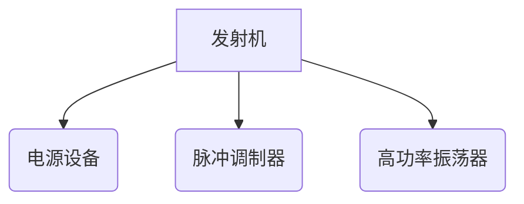

<head>
    <script src="https://cdn.mathjax.org/mathjax/latest/MathJax.js?config=TeX-AMS-MML_HTMLorMML" type="text/javascript"></script>
    <script type="text/x-mathjax-config">
        MathJax.Hub.Config({
            tex2jax: {
            skipTags: ['script', 'noscript', 'style', 'textarea', 'pre'],
            inlineMath: [['$','$']]
            }
        });
    </script>
</head>


# 1、基本概念补充



## 流程图模板：

  ```mermaid
  graph TD
  A[Hard edge] -->B(Round edge)
      B --> C{Decision}
      C -->|One| D[Result one]
      C -->|Two| E[Result two]
  ```

  ```mermaid
graph TD
subgraph __
A(开始) -->B[读取配置]
B-->C[初始化日志]
C-->C1[初始化各终端状态]
C1-->E[绑定端口]
E-->F[等待连接]
F-->G{连接成功?}
end 
subgraph _
G-->|Y|H[创建客户端指令线程]
H-->H1[等待指令]
H1-->M{指令到来}
M-->|Y|M1[解析指令]
M1-->M2{控制中心 or 定制终端?}
M2-->|控制中心|M3[状态存储 指令转发]
M2-->|定制终端|M4[指令响应反馈]
M3-->M5[状态存储]
M4-->M5
M-->|N|H1
end

subgraph _
G-->|Y|H2[创建客户端心跳线程]
H2-->H4[等待回复心跳包]
H4-->H3{等待超时?}
H3-->|N|H5[发送心跳包]
H3-->|Y|H6[心跳线程退出]
H6-->H7[对应客户端状态清理]
H7-->F
G-->|N|F
end


subgraph _
F--程序异常-->N(结束)
end
  ```


## 1.1 频域参数

### 载波

载波或者载频（载波频率）是一个物理概念，是一个特定频率的无线电波，单位Hz，是一种在频率、幅度或相位方面被调制以传输语言、音频、图象或其它信号的电磁波。

### 带宽

**带宽**（英语：**Bandwidth**）指[信号](https://zh.wikipedia.org/wiki/信号)所占据的[频带](https://zh.wikipedia.org/wiki/频带)宽度；在被用来描述[信道](https://zh.wikipedia.org/wiki/信道)时，带宽是指能够有效通过该信道的信号的最大频带宽度。


