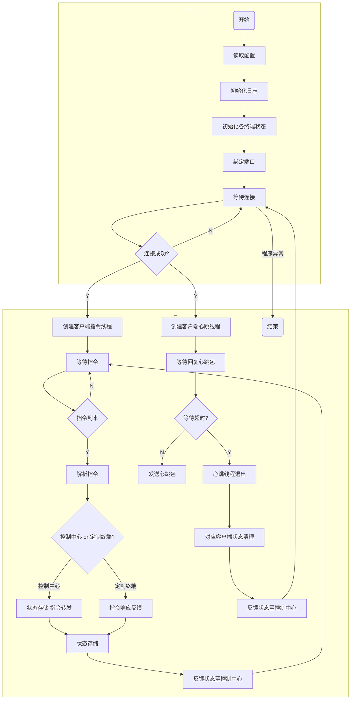

<head>
    <script src="https://cdn.mathjax.org/mathjax/latest/MathJax.js?config=TeX-AMS-MML_HTMLorMML" type="text/javascript"></script>
    <script type="text/x-mathjax-config">
        MathJax.Hub.Config({
            tex2jax: {
            skipTags: ['script', 'noscript', 'style', 'textarea', 'pre'],
            inlineMath: [['$','$']]
            }
        });
    </script>
    <script src="//unpkg.com/mermaid@8.4.8/dist/mermaid.min.js"></script>
	<script>mermaid.initialize({startOnLoad:true});</script>
</head>




 ```mermaid
graph TD
A(开始) -->B[读取配置]
B-->C[连接后台服务器]
C-->D{后台服务器在线?}
D--Y-->E[连接成功]
E-->G[接收指令]


G-->M[指令解析]
M-->G1{操作指令?后台反馈指令}
G1--操作指令-->G3{是否关闭软件?}
G3--Y-->G4(结束)


G3--N-->G2[指令转发至后台服务器]
G1--反馈指令-->N
G2-->N[更新界面]
N-->G

D--N-->F[连接失败]
F-->C

 ```