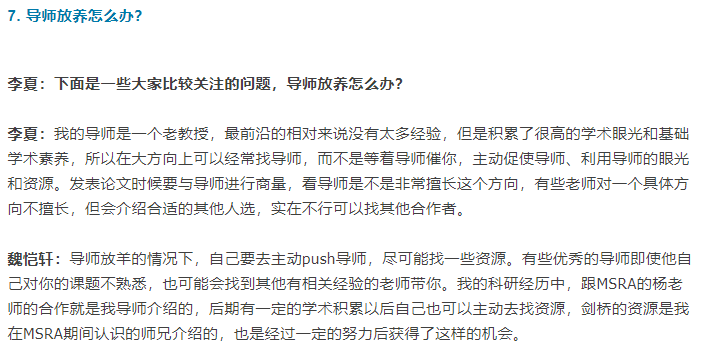

<head>
    <script src="https://cdn.mathjax.org/mathjax/latest/MathJax.js?config=TeX-AMS-MML_HTMLorMML" type="text/javascript"></script>
    <script type="text/x-mathjax-config">
        MathJax.Hub.Config({
            tex2jax: {
            skipTags: ['script', 'noscript', 'style', 'textarea', 'pre'],
            inlineMath: [['$','$']]
            }
        });
    </script>
</head>


# 如何改变wins上jupyter notebook 的工作目录？

打开pytho/anconda 终端，输入jupyter notebook --notebook-dir=/Users/yourname/folder1/folder2/


## pytorch训练中指定GPU的方法

* 执行脚本的时候`CUDA_VISIBLE_DEVICES=0,1,2,3 xxx.py` to specify GPU

* ```python
  import os 
  os.environ["CUDA_VISIBLE_DEVICES"]="1"
  ```

* jupyter 中加入

  ```python
  %env CUDA_VISIBLE_DEVICES=1
  ```

* py文件中

  ```
  device = torch.device('cuda:0' if torch.cuda.is_available() else 'cpu')
  
  ```

  

# ubuntu给普通用户添加超级用户权限

sudo usermod -aG sudo username

a: 添加

G:分组

username 替换成具体用户名

# study



# docker  容器内matplotlib 显示图片的办法

### 1 安装jupyter并配置远程访问

1.1 准备工作

​	（1）确认已开启ssh服务

```shell
service ssh status
```

​	未开启则开启，若出现unrecongised service ssh，需要安装ssh服务

```
apt-get install openssh-client
apt-get install openssh-server
```

​	再输入 /etc/init.d/ssh restart

​	此时需要更新当前镜像，否则下次退出容器，再用同一个镜像创建容器，会发现依然没有安装ssh

​	输入 docker commit containerid imagename

```shell
docker commit c3f279d17e0a（Container ID）   tensorflow/tensorflow:1.2.1-devel-gpu-py3(image name)
```

​	（2） 确保容器8888(jupyter 浏览默认端口) 已被隐射至主机某一端口，方法 -p 8021:8888 (宿主机端口：容器端口)

1.1 jupyter 配置远程访问方法

（1）终端输入ipython

（2）输入代码

```python
from notebook.auth import passwd
passwd()
```

输入密码，生成类似于如下字符串密钥：

’sha1:41e4da01dde4:e820dc9c0398eda2dc9323c9e4a51ea1228166a2’

复制下来

（3）jupyter notebook --generate-config --allow-root 

​		生成配置文件 ~/.jupyter/jupyter_notebook_config.py

  (4) vim  ~/.jupyter/jupyter_notebook_config.py

​		找到如下对应项，并修改如下:

```python
c.NotebookApp.ip=’*’  #允许任意ip访问
c.NotebookApp.password = u’sha1:41e4da01dde4:e820dc9c0398eda2dc9323c9e4a51ea1228166a2’ # 刚才的密码
c.NotebookApp.open_browser = False  #jupyter notebook 开启后不自动启动系统浏览器
c.NotebookApp.port =8888 # 隐射端口
```
（5）启动并放入后台，输入：nohup jupyter notebook --allow-root >jupyter.log 2>&1 & ,此时在任意浏览器输入宿主机ip:8021(容器隐射至宿主机的端口号) 输入刚才的密码就可以访问了。

### 2 配置环境，让启动容器的终端和容器共享一个显示终端

2.1 安装依赖

```shell
#需要安装几个依赖库并重新安装matplotlib
sudo apt-get install tcl-dev tk-dev python3-tk
pip uninstall matplotlib
pip install matplotlib
```

这样可以让matplotlib的backend为’Tkagg‘，具体参考[Matplotlib无法显示图像的问题](https://www.jianshu.com/p/6fdde6429433)

2.2 保存镜像

docker commit [CONTAINER ID] [IMAGE]

2.3 

```shell
docker run --rm  -p 8022:22 -p 8021:8888 --gpus device=1  --name="Pytorch1.2" -v /home/***/CurrentProject/segan_pytorch_ppg:/workspace --network=host --privileged   -v /dev:/dev   -e DISPLAY=$DISPLAY     -v /tmp/.X11-unix:/tmp/.X11-unix   -v $HOME/.Xauthority:/root/.Xauthority  -dit pytorch/pytorch:1.2-cuda10.0-cudnn7-devel  /bin/bash
```

–net=host是用来联网的（用主机的网）

–env=“DISPLAY” 是修改容器中的环境变量DISPLAY

-v /tmp/.X11-unix:/tmp/.X11-unix 是为了共享本地unix端口

# jupyter 常用快捷键

`ctrl+shift+p `:显示命令配置

`F`:查找并替换

`空格`：向下翻页/滚动

`shift+空格`：向上翻页/滚动

`H`：打开快捷键

`0，0`：重启服务，带窗口

`I,I`:中断服务

