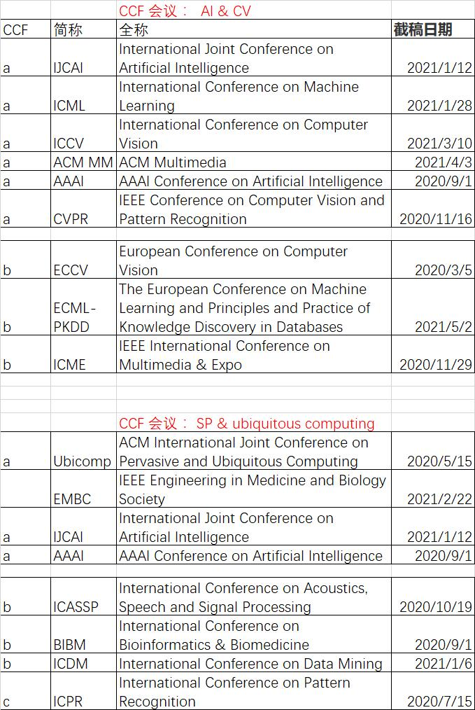

<head>
    
    
</head>

| [IEEE Journal of Selected Topics in Signal Processing](https://www.letpub.com.cn/index.php?page=journalapp&view=detail&journalid=3338) |
| ------------------------------------------------------------ |
| [SIGNAL PROCESSING](https://www.letpub.com.cn/index.php?page=journalapp&view=detail&journalid=7505) |
| [IEEE TRANSACTIONS ON SIGNAL PROCESSING](https://www.letpub.com.cn/index.php?page=journalapp&view=detail&journalid=3419) |

	

| 名称                                                         | 级别                  | 截稿日期                                                     | 通知日期   |
| ------------------------------------------------------------ | --------------------- | ------------------------------------------------------------ | ---------- |
| IEEE International Conference on Acoustics, Speech and Signal Processing[ICASSP] (h5-index:86) | **CCF  B Conference** | 2021/10/19                                                   |            |
| IEEE Transactions on Information Forensics and Security[TIFS] (h5-index:86) | **CCF  A Journal**    | 期刊无固定截稿日期，可从论文的接收修改日期中推断大致审稿时长 |            |
| [IEEE Internet of Things Journal](https://ieeexplore.ieee.org/xpl/RecentIssue.jsp?punumber=6488907) | **Q1 Journal**        |                                                              |            |
| IET Signal Processing                                        | **CCF C Journal**     |                                                              |            |
| [IEEE Access](https://ieeexplore.ieee.org/xpl/RecentIssue.jsp?punumber=6287639) | **Q3 Journal**        |                                                              |            |
| Digital Signal Processing                                    | **Q3**                |                                                              |            |
| [EEE International Conference on Computational Intelligence and Applications](https://www.myhuiban.com/conference/2245) |                       | 2021-05-05                                                   | 2021-05-15 |
| FAIML 2021: International Conference on Frontiers of Artificial Intelligence and Machine Learning |                       | 2021-05-10                                                   | 2021-06-20 |
| bicomp 2021: ACM International Joint Conference on Pervasive and Ubiquitous Computing | CCF A                 | 2021-06-04                                                   | 2021-07-20 |
| 7th International Conference on Signal Processing and Pattern Recognition |                       | 2021-05-15                                                   | 2021-06-20 |
| International Conference on Machine Learning Techniques and Data Science (MLDS 2021) |                       | 2021-05-15                                                   | 2021-05-29 |
| NeurIPS 2021: Conference on Neural Information Processing Systems | CCF A                 | 2021-05-19                                                   | 2021-09-28 |
| 10th International Conference on Signal, Image Processing and Pattern Recognition (SPPR 2021) |                       | 2021-05-15                                                   | 2021-07-20 |
| ACCC 2021: Asia Conference on Computers and Communications   |                       | 2021-05-25                                                   | 2021-06-15 |
| CIKM 2021: ACM International Conference on Information and Knowledge Management | CCF B                 | 2021-05-26                                                   | 2021-08-09 |
| [European Conference on Computer Science and Information Technology](https://www.myhuiban.com/conference/3970) |                       | 2021-08-15                                                   | 2021-09-05 |

# UESTC重要国际会议(2016版)

| 名称                                                         | 级别 | 截稿日期   | 通知日期   |
| ------------------------------------------------------------ | ---- | ---------- | ---------- |
| Asia-Pacific  Signal and Information Processing Association  |      | 2021-07-01 | 2021-08-31 |
| ACM  International Conference on Ubiquitous Computing        |      | 2021-06-15 | 2021-07-15 |
| International  Conference on Signal Processing               |      | 2021-05-25 | 2021-06-15 |
| International  Conference on Wireless Communications and Signal Processing |      | 2021-06-15 | 2021-08-01 |
| international conference on digital signal processing        |      | 2021-09-15 | 2021-10-15 |

# 清华大学重要国际会议

| 名称                                                         | 级别    | 截稿日期     | 通知日期   |
| ------------------------------------------------------------ | ------- | ------------ | ---------- |
| Asia Conference on Pattern Recognition                       | B类会议 | 2021-06-19   | 2021-08-10 |
| Asian Conference on Machine Learning                         | B类会议 | 2021-06-25   | 2021-09-03 |
| IEEE International Conference on Acoustics, Speech and Signal Processing | A类会议 | 已过截稿日期 |            |

 

